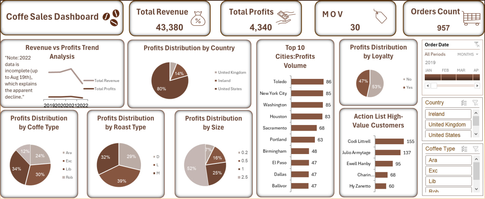

# ☕ Coffee Sales Analysis – Profitability & Loyalty Insights

## Project Overview
A sales analysis project designed to transform raw coffee shop data into actionable business insights, focusing on profitability, customer behavior, and loyalty effectiveness.

## Dashboard Preview

---

## Business Goals
- Understand revenue and profit drivers: Analyzing the financial health of the coffee shop.
- Identify high-value customers: Finding the most loyal and profitable clients.
- Evaluate loyalty program performance: Measuring how the program impacts sales.
- Support data-driven decision making: Providing clear recommendations based on data.

---

## Data Model
- Customers: demographics, location, and loyalty status.
- Products: coffee type, roast level, size, pricing, and profit.
- Orders: transactions, quantities, and order dates.

A Star Schema was modeled using Power Pivot with normalized tables to ensure optimal performance and accuracy.

---

## Technical Highlights (Custom Logic)
To improve data quality, I created a custom column in Power Query to identify reachable loyalty customers:
`powerquery
if([Phone Number]=null and [Email]=null) and [Loyalty Card]="Yes" 
then "Needs Contact Info" 
else "Valid"

Impact: This helped isolate the Top 5 High-Value customers who contribute significantly to profit but have no contact methods (e.g., Codi Littrell).
KPIs (Key Performance Indicators)
 * Total Revenue: 43,380
 * Total Profit: 4,340
 * Orders Count: 957
 * Average Order Value (AOV): 45
 * Median Order Value (MOV): 30 (used instead of average to account for data skewness)
Key Insights
 * Geographic Focus: The U.S. generates ~80% of total profit (3,451).
 * Top Cities: Toledo, NYC, and Washington are the most profitable cities.
 * Loyalty Gaps: Several high-value loyalty customers are missing contact data, risking retention.
 * Product Trends: 2.5kg packs and Medium roast are the most preferred by customers.
Note: 2022 data is incomplete (available until Aug 19), explaining the apparent trend decline.
Business Recommendations
 * Loyalty Recovery: Target the Top 5 customers identified in the "Action List" to recover missing contact info.
 * Strategic Expansion: Focus marketing efforts in top-performing U.S. cities.
 * Inventory Optimization: Stock more of the 2.5kg packs and Arabica/Robusta types as they show the highest sales volume.
Tools Used
Excel | Power Query | Power Pivot
This project was independently designed to simulate a real-world business scenario.
